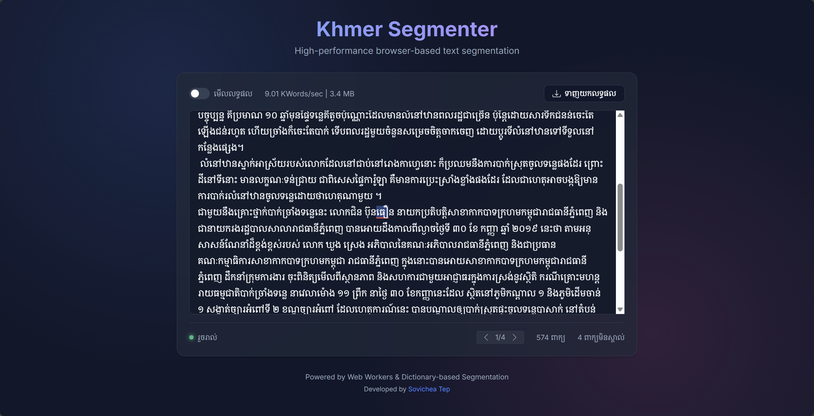
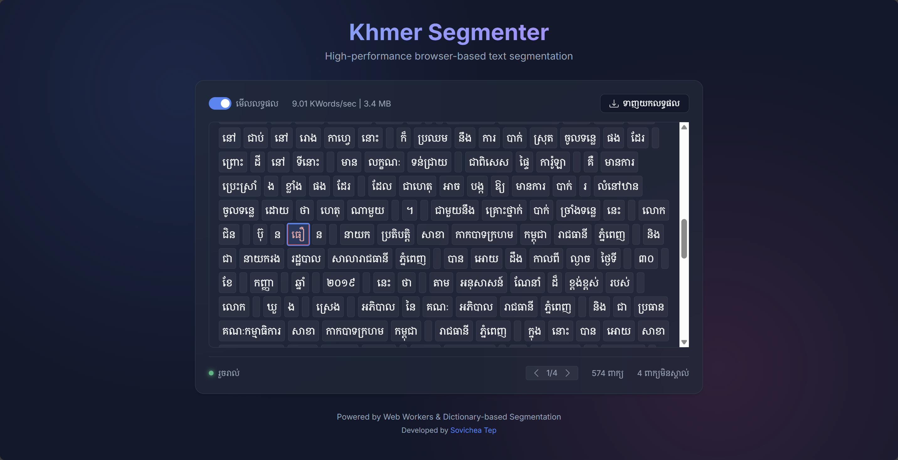

# Khmer Word Segmentation Algorithm

I've implemented a probabilistic word segmentation algorithm for the Khmer language using a **Viterbi** approach (finding the shortest path in a graph of possible segments) weighted by word probabilities derived from a text corpus.

## Try it out!

🚀 **[Live Demo](https://sovichea.github.io/khmer_segment_webui_demo/)**

### 1. Editor Mode



**Real-time Segmentation & Editing**
*   **Native Typing Experience**: Type quickly with zero lag.
*   **Instant Feedback**: Unknown words are underlined in red, updating in real-time (~0.3ms latency) as you type.
*   **Smart Paste**: Automatically re-segments pasted text while preserving formatting signals.

### 2. View Mode



**Visual Analysis & Navigation**
*   **Segmentation Blocks**: See exactly how the algorithm splits each word.
*   **Navigation Tools**: Jump instantly between unknown words to verify potential errors or new vocabulary.
*   **Analytics**: View word count and unknown word statistics.


## Acknowledgements

*   **[khmernltk](https://github.com/VietHoang1512/khmer-nltk)**: Used for benchmarking.
*   **[sovichet](https://github.com/sovichet)**: For providing the [Khmer Folktales Corpus](https://github.com/sovichet) and Dictionary resources.
*   **[phylypo](https://github.com/phylypo/segmentation-crf-khmer)**: For providing the `kh_data_10000b` dataset used for frequency analysis.


> [!IMPORTANT]
> **Disclaimer:** My dictionary is still lacking many curated sources of technical words. If anyone can contribute curated Khmer words with credible sources, the algorithm will improve significantly. I highly appreciate your contributions to improving the data quality!


## Why Dictionary-First?

**TL;DR:** Most ML-based Khmer segmentation relies on inconsistent Zero-Width Space (ZWS) annotations in training data. Since 100 people annotate ZWS differently, models learn "average human inconsistency" rather than linguistic correctness. I ignore ZWS entirely, using curated dictionaries and frequency-based Viterbi search for **deterministic, dictionary-accurate segmentation**.

### Key Advantages

✅ **100% Deterministic** – Same input always produces identical output  
✅ **Explainable** – Update dictionary/frequency = instant improvement  
✅ **Ultra-Fast** – ~0.34ms/call (C port) vs. ~5-50ms for transformers  
✅ **Portable** – Runs on embedded systems, mobile, web (WASM), and cloud  
✅ **No Training** – Works immediately without GPU/annotation costs

### Real-World Applications

I've built this as **foundational infrastructure** for:

- **ML Research**: Clean training data for Khmer LLMs by providing dictionary-accurate baselines
- **Spellcheck/Grammar Tools**: Essential word boundary detection for text editors, IDEs, browsers, and mobile keyboards
- **Production Systems**: Reliable segmentation for technical documentation, legal/medical applications, and embedded devices

📖 **[Read the full design philosophy and use cases ▸](docs/DESIGN_PHILOSOPHY.md)**

## Installation

To install the required dependencies, run:

```bash
pip install -r requirements.txt
```

## Usage

```python
from khmer_segmenter import KhmerSegmenter

# Initialize (Loads dictionary from default path)
seg = KhmerSegmenter()

# Segment text
text = "ក្រុមហ៊ុនទទួលបានប្រាក់ចំណូល"
result = seg.segment(text)

print(result) 
# Output: ['ក្រុមហ៊ុន', 'ទទួល', 'បាន', 'ប្រាក់ចំណូល']
```

## C Port (High Performance)

For users requiring maximum performance or embedding in C/C++/Zig applications, a native port is available in the [port/c/](port/c/) directory. All ports share common linguistic data found in [port/common/](port/common/).

*   **Speed**: ~16x faster (Single Thread), more than 30x faster (Multi-Thread) running in WSL.
*   **Architecture**: Zero-dependency, **Regex-Free** Rule Engine (Hardcoded logic) for consistent O(n) performance.
*   **Documentation**: See [port/c/README.md](port/c/README.md).
## 1. Data Preparation (`scripts/prepare_data.py`)

I've built a consolidated data pipeline to normalize text, generate frequencies, and compile binary dictionaries for all ports.

### Pipeline Steps:
1.  **Normalize**: Strips ZWS, ZWNJ, and fixes composite vowels/clusters in the corpus.
2.  **Generate Frequencies (Iterative)**: Uses the C-based `khmer_segmenter` to iteratively segment the corpus and refine word frequencies (Self-Supervised).
    > **Robustness**: This method starts with a clean slate (dictionary only) and converges to a stable frequency distribution in **minimal iterations** (typically 3 passes). It is robust against initial noise and effectively learns the corpus's natural word usage without external dependencies.
3.  **Compile Binaries**:
    *   `khmer_dictionary.kdict`: Optimized Hash Table for C/Zig port (Saved to `port/common/`).
    *   `khmer_frequencies.bin`: Legacy binary format (Saved to `port/common/`).

> [!NOTE]
> **Compressed Dataset**: The extended frequency dataset is stored as `dataset/kh_data_10000b_200b.zip` to reduce repository size. If you wish to use this data for frequency generation, please **extract it manually** before running the scripts. The `prepare_data.py` script will automatically find the extracted `.txt` files if they are placed in the `experiments/` or `dataset/` folder.

### Usage

Run the pipeline to rebuild all data assets:
```bash
# Run with default settings (uses internal segmenter)
python scripts/prepare_data.py

# Specify custom corpus or dictionary
python scripts/prepare_data.py --corpus dataset/my_corpus.txt --dict khmer_segmenter/dictionary_data/my_dict.txt

```

To add new words:
1.  Add word to `khmer_segmenter/dictionary_data/khmer_dictionary_words.txt`.
2.  Run `python scripts/prepare_data.py`.
3.  The new word is now compiled into `khmer_dictionary.kdict` and ready for the C port.

### Incremental Updates (`scripts/incremental_update.py`)

If you are adding new words and want to assign them frequencies based on your existing corpus (using the unknown word frequencies captured during `prepare_data.py`), use the incremental update script. This is faster than re-running the full pipeline.

1.  **Ensure you have unknown word data**: Run `prepare_data.py` at least once to generate `khmer_segmenter/dictionary_data/unknown_word_frequencies.json`.
2.  **Add new words**: Add your new words to `khmer_segmenter/dictionary_data/khmer_dictionary_words.txt`.
3.  **Run the update**:
    ```bash
    python scripts/incremental_update.py \
      --dict khmer_segmenter/dictionary_data/khmer_dictionary_words.txt \
      --freq khmer_segmenter/dictionary_data/khmer_word_frequencies.json \
      --unknown-freq khmer_segmenter/dictionary_data/unknown_word_frequencies.json
    ```
    This script will:
    *   Find words in your dictionary that are missing from the frequency list.
    *   Look up their count in `unknown_word_frequencies.json`.
    *   If not found, try to derive frequency from component words (for compounds).
    *   Otherwise, assign a default floor frequency.
    *   Update `khmer_word_frequencies.json`.

## 2. The Segmentation Algorithm

For a detailed step-by-step explanation of the Viterbi algorithm, Normalization logic, and Rules I use in this project, please refer to the **[Porting Guide & Algorithm Reference](port/README.md)**.

## 3. Comparison with khmernltk

I compared the performance and output of `KhmerSegmenter` against `khmernltk` using a complex sentence from a folktale.

### Finding Unknown Words

You can analyze the segmentation results to find words that were not in the dictionary (potential new words or names):

```bash
python scripts/find_unknown_words.py --input segmentation_results.txt
```

This will generate `output/unknown_words_from_results.txt` showing the unknown words, their frequency, and **context** (2 words before and after) to help you decide if they should be added to the dictionary.

## 4. Benchmark & Performance Comparison

I provide two benchmarks: one for **Real-Time Latency** (single sentence, micro-benchmark) and one for **Batch Throughput** (large corpus, macro-benchmark).

### Benchmark Results
*Context: Comparison across two scenarios: (1) **Micro-Benchmark** (Latency/Real-time) simulating single-sentence requests, and (2) **Macro-Benchmark** (Throughput) processing a large 50k-line corpus.*

| Scenario | Metric | khmernltk | Python (v3) | C Port | Rust Port | Notes |
| :--- | :--- | :--- | :--- | :--- | :--- | :--- |
| **Micro-Benchmark** | Latency (Seq) | ~2.90 ms | ~2.21 ms | ~0.36 ms | **~0.34 ms** | Lower is better |
| **Micro-Benchmark** | Throughput (4-Thread) | ~330 calls/s | ~503 calls/s | ~10,970 calls/s | **~10,909 calls/s** | Higher is better |
| **Macro-Benchmark** | Throughput (4-Thread) | ~378 lines/s | ~585 lines/s | ~30,838 lines/s | **~31,250 lines/s** | File I/O + Process |
| **Memory Usage** | Baseline (Init) | ~113 MB | ~36 MB | ~4.8 MB | **~2.2 MB** | Dict Load |
| **Memory Usage** | Overhead (Conc) | ~12 MB | ~18 MB | ~0.2 MB | **~0.0 MB** | Efficiency |

*> Note: Benchmarks run on standard consumer hardware (Linux/Ryzen 7) with 4 threads.*

### Performance Analysis

#### 1. Massive Throughput (C Port)
With file-based benchmarking on Linux, the C port processes **~30,838 lines per second** using 4 threads, compared to ~553 lines/sec in Python. This **~55x speedup** validates the linear scaling and SIMD optimizations of the C implementation on multi-core systems, making it suitable for high-volume ETL pipelines.

#### 2. Concurrency & The GIL
Python-based segmenters (both ours and `khmernltk`) see **negative scaling** (0.9x speedup) when adding threads due to the **Global Interpreter Lock (GIL)** and overhead. Python is strictly limited to single-core CPU speeds for this workload.

#### 3. Low Latency & Cold Start
`KhmerSegmenter` initializes in **~0.28s**, whereas `khmernltk` takes **~1.8s+** to load its model. This makes `KhmerSegmenter` ideal for "Serverless" functions where startup latency is a primary billing and UX concern.

### Real-World Complex Sentence Example

**Input:**
> "ក្រុមហ៊ុនទទួលបានប្រាក់ចំណូល ១ ០០០ ០០០ ដុល្លារក្នុងឆ្នាំនេះ ខណៈដែលតម្លៃភាគហ៊ុនកើនឡើង ៥% ស្មើនឹង 50.00$។ លោក ទេព សុវិចិត្រ នាយកប្រតិបត្តិដែលបញ្ចប់ការសិក្សាពីសាកលវិទ្យាល័យភូមិន្ទភ្នំពេញ (ស.ភ.ភ.ព.) បានថ្លែងថា ភាពជោគជ័យផ្នែកហិរញ្ញវត្ថុនាឆ្នាំនេះ គឺជាសក្ខីភាពនៃកិច្ចខិតខំប្រឹងប្រែងរបស់ក្រុមការងារទាំងមូល និងការជឿទុកចិត្តពីសំណាក់វិនិយោគិន។"

**khmernltk Result (v1.5):**
> `ក្រុមហ៊ុន` | `ទទួលបាន` | `ប្រាក់` | `ចំណូល` | ` ` | `១` | ` ` | `០០០` | ` ` | `០០០` | ` ` | `ដុល្លារ` | `ក្នុង` | `ឆ្នាំ` | `នេះ` | ` ` | `ខណៈ` | `ដែល` | `តម្លៃ` | `ភាគហ៊ុន` | `កើនឡើង` | ` ` | `៥%` | ` ` | `ស្មើនឹង` | ` ` | `50.` | `00$` | `។` | ` ` | `លោក` | ` ` | `ទេព` | ` ` | `សុវិចិត្រ` | ` ` | `នាយក` | `ប្រតិបត្តិ` | `ដែល` | `បញ្ចប់` | `ការសិក្សា` | `ពី` | `សាកលវិទ្យាល័យ` | `ភូមិន្ទ` | `ភ្នំពេញ` | ` ` | `(` | `ស.` | `ភ.` | `ភ.` | `ព.` | `)` | ` ` | `បាន` | `ថ្លែង` | `ថា` | ` ` | `ភាពជោគជ័យ` | `ផ្នែក` | `ហិរញ្ញវត្ថុ` | `នា` | `ឆ្នាំ` | `នេះ` | ` ` | `គឺជា` | `សក្ខីភាព` | `នៃ` | `កិច្ច` | `ខិតខំ` | `ប្រឹងប្រែង` | `របស់` | `ក្រុមការងារ` | `ទាំងមូល` | ` ` | `និង` | `ការជឿទុកចិត្ត` | `ពីសំណាក់` | `វិនិយោគិន` | `។`

**KhmerSegmenter Result:**
> `ក្រុមហ៊ុន` | `ទទួល` | `បាន` | `ប្រាក់ចំណូល` | ` ` | `១` | ` ` | `០០០` | ` ` | `០០០` | ` ` | `ដុល្លារ` | `ក្នុង` | `ឆ្នាំ` | `នេះ` | ` ` | `ខណៈ` | `ដែល` | `តម្លៃ` | `ភាគហ៊ុន` | `កើនឡើង` | ` ` | `៥` | `%` | ` ` | `ស្មើនឹង` | ` ` | `50.00` | `$` | `។` | ` ` | `លោក` | ` ` | `ទេព` | ` ` | `សុវិចិត្រ` | ` ` | `នាយក` | `ប្រតិបត្តិ` | `ដែល` | `បញ្ចប់` | `ការសិក្សា` | `ពី` | `សាកលវិទ្យាល័យ` | `ភូមិន្ទ` | `ភ្នំពេញ` | ` ` | `(` | `ស.ភ.ភ.ព.` | `)` | ` ` | `បាន` | `ថ្លែង` | `ថា` | ` ` | `ភាព` | `ជោគជ័យ` | `ផ្នែក` | `ហិរញ្ញវត្ថុ` | `នា` | `ឆ្នាំ` | `នេះ` | ` ` | `គឺជា` | `សក្ខីភាព` | `នៃ` | `កិច្ច` | `ខិតខំ` | `ប្រឹងប្រែង` | `របស់` | `ក្រុមការងារ` | `ទាំងមូល` | ` ` | `និង` | `ការ` | `ជឿ` | `ទុកចិត្ត` | `ពីសំណាក់` | `វិនិយោគិន` | `។`

**Key Differences:**
1.  **Numbers**: `khmernltk` splits `១ ០០០ ០០០` into 5 tokens. `KhmerSegmenter` also splits them to support granular processing.
2.  **Acronyms**: `khmernltk` destroys `(ស.ភ.ភ.ព.)` into multiple tokens. `KhmerSegmenter` keeps it as **one**.
3.  **Dictionary Adherence**: `KhmerSegmenter` strictly adheres to the dictionary. For example, it correctly splits `ភាគហ៊ុន` into `ភាគ` | `ហ៊ុន` if `ភាគហ៊ុន` isn't in the loaded dictionary but the parts are (or vice versa depending on dictionary state). *Note: Benchmarks reflect the current state of `khmer_dictionary_words.txt`. As you add words like `ភាគហ៊ុន`, the segmenter will automatically group them.*

## 5. Portability & Universal Compatibility

`KhmerSegmenter` is designed with a "Run Anywhere" philosophy. Unlike modern ML models that are tied to heavy runtimes (Python/PyTorch/TensorFlow) and specific hardware, this algorithm is pure mathematical logic.

### Multi-Platform & Infrastructure
The implementation is verified and optimized for all major operating systems and architectures:
- ✅ **Windows, Linux, macOS, BSD** (x86_64, ARM64, Apple Silicon)
- ✅ **Cloud & Serverless**: Minimal cold start (<50ms in C) for AWS Lambda, Google Cloud Functions, and Edge Computing.
- ✅ **Embedded & IoT**: Runs on bare-metal C, RTOS, and microcontrollers (Arduino, ESP32, STM32) with as little as 9MB of RAM.

### Language Agnostic Architecture
The core Viterbi logic and Normalization rules rely only on standard data structures. It can be ported to any language:
- **High-Level**: Python (Official), JS/TS, Go, Java, C#.
- **Native**: C (Official), C++, Rust, Zig.
- **Web**: Compile to **WASM** for blazingly fast client-side performance.

### Zero-Dependency & Hardware Lean
- **Zero External Libs**: Works without `numpy`, `scikit-learn`, or `khmernltk` at runtime.
- **No GPU Required**: Strictly CPU-based, deterministic, and 100% reproducible across different hardware.

## 6. Testing & Verification

You can verify the segmentation logic using the `scripts/test_viterbi.py` script. This script supports both single-case regression testing and batch processing of a corpus.

### Run Standard Test Cases
```bash
python scripts/test_viterbi.py
```

### Batch Process a Corpus
To test against a file and see the output:
```bash
python scripts/test_viterbi.py --source dataset/khmer_folktales_extracted.txt --limit 500
```
This will generate `output/segmentation_results.txt`.

## 7. License

MIT License

Copyright (c) 2026 Sovichea Tep

Permission is hereby granted, free of charge, to any person obtaining a copy
of this software and associated documentation files (the "Software"), to deal
in the Software without restriction, including without limitation the rights
to use, copy, modify, merge, publish, distribute, sublicense, and/or sell
copies of the Software, and to permit persons to whom the Software is
furnished to do so, subject to the following conditions:

The above copyright notice and this permission notice shall be included in all
copies or substantial portions of the Software.

THE SOFTWARE IS PROVIDED "AS IS", WITHOUT WARRANTY OF ANY KIND, EXPRESS OR
IMPLIED, INCLUDING BUT NOT LIMITED TO THE WARRANTIES OF MERCHANTABILITY,
FITNESS FOR A PARTICULAR PURPOSE AND NONINFRINGEMENT. IN NO EVENT SHALL THE
AUTHORS OR COPYRIGHT HOLDERS BE LIABLE FOR ANY CLAIM, DAMAGES OR OTHER
LIABILITY, WHETHER IN AN ACTION OF CONTRACT, TORT OR OTHERWISE, ARISING FROM,
OUT OF OR IN CONNECTION WITH THE SOFTWARE OR THE USE OR OTHER DEALINGS IN THE
SOFTWARE.

This project is licensed under the MIT License - see the [LICENSE](LICENSE) file for details.

You are free to use, modify, and distribute this software, but you **must acknowledge usage** by retaining the copyright notice and license in your copies.


